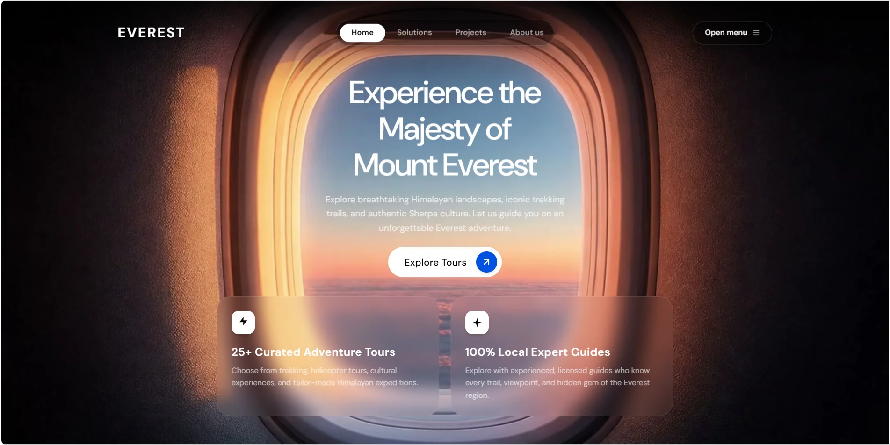

<div align="center">

# 🏔️ EVEREST — Cinematic Scroll Experience

### *A travel landing page where the journey begins the moment you scroll*

<br/>


<br/>



<br/>
<br/>

**A scroll-scrubbed video experience.** As you scroll, 340 hand-extracted HD frames play like film —
taking you from an airplane window at golden hour all the way to the roof of the world.

</div>

---

## ✨ What Makes It Special

|     | Feature | Description |
|:---:|---------|-------------|
| 🎞️ | **Scroll-Driven Cinematics** | The background is a `<canvas>` scrubbing through **340 full-HD frames** mapped to scroll position — with lerp smoothing for buttery, inertia-like motion |
| 🪟 | **Airplane Window Hero** | Headline, subtext, and CTA are precision-positioned inside the plane window for a "looking out at adventure" moment |
| 📝 | **Word-by-Word Headlines** | Every section heading reveals word-by-word with blur-to-sharp, rise, and stagger — like premium editorial sites |
| 🃏 | **Living Cards** | Glassmorphic cards with gradient depth, floating icons, hover lifts, and directional entrances (left / right / rise / scale) |
| 🔢 | **Count-Up Statistics** | Case-study numbers (`$15-25 CPL`, `263 students`, `11.11X ROAS`) animate from zero every time they enter the viewport |
| 🔁 | **Replay on Scroll** | Animations don't fire once and die — every section re-animates each time you scroll to it, in both directions |
| 🌈 | **Ambient Motion** | Pulsing color spotlights, a spinning diamond accent, and letter-spacing glides keep the page alive even at rest |
| 📦 | **Zero Build, Zero Dependencies** | One HTML file. No framework, no bundler, no `node_modules`. Open it and it works |

---

## 🎬 The Scroll Journey

```
┌──────────────────────────────────────────────────────────┐
│  ✈️  HERO          Airplane window · golden hour          │
│                    "Experience the Majesty of             │
│                     Mount Everest"                        │
├──────────────────────────────────────────────────────────┤
│  🤝  TRUST         Brand logos stagger in one-by-one      │
├──────────────────────────────────────────────────────────┤
│  🎨  STUDIO        4 staggered cards · blue gradients     │
├──────────────────────────────────────────────────────────┤
│  💬  CASE STUDY    Testimonial + live count-up stats      │
├──────────────────────────────────────────────────────────┤
│  🧭  CAPABILITIES  4 cards framing an open center where   │
│                    the animation shines through           │
├──────────────────────────────────────────────────────────┤
│  🏁  FOOTER        Journey complete — frame 340 of 340    │
└──────────────────────────────────────────────────────────┘
```

Throughout the entire page, the fixed canvas background keeps playing —
**every pixel of scroll advances the film.**

---

## 🚀 Getting Started

No install. No build. Pick your favorite:

**Option 1 — Just open it**
```bash
git clone https://github.com/manojpoudel9256/travel_site.git
cd travel_site
start index.html        # Windows
```

**Option 2 — Local server (recommended for best frame loading)**
```bash
python -m http.server 8000
# then visit http://localhost:8000
```

---

## 🧠 How the Scroll Animation Works

```js
// 1. Map full-page scroll progress → frame index (0–339)
progress    = scrollY / (pageHeight - viewportHeight)
targetFrame = progress * (FRAME_COUNT - 1)

// 2. Ease toward the target every animation frame (the "buttery" part)
currentFrame += (targetFrame - currentFrame) * 0.12

// 3. Draw with cover-fit on a devicePixelRatio-aware canvas
ctx.drawImage(frames[Math.round(currentFrame)], ...)
```

The frames were extracted from the source video with **FFmpeg** and encoded as
**WebP** — half the size of JPEG at the same visual quality:

```bash
ffmpeg -i source.mp4 -c:v libwebp -quality 82 frames/frame-%03d.webp
```

All entrance animations run on a single `IntersectionObserver` — elements toggle
their `visible` class as they enter and leave the viewport, and pure CSS
transitions (with per-word / per-card stagger delays) do the rest. The reveal
system uses the independent `translate` / `scale` CSS properties, so it stacks
cleanly with Tailwind's transform utilities.

---

## 📁 Project Structure

```
travel_site/
├── index.html                   # The entire site — markup, styles & logic
├── frames/                      # 340 HD WebP frames (1920×1080, scroll-scrubbed)
│   ├── frame-001.webp
│   ├── ...
│   └── frame-340.webp
├── assets/
│   └── images/                  # Section imagery (WebP)
└── landingpage_travelsite.webp  # The screenshot above
```

---

## 🎨 Design Language

- **Typography** — [DM Sans](https://fonts.google.com/specimen/DM+Sans) for UI · [Playfair Display](https://fonts.google.com/specimen/Playfair+Display) italics for editorial accents
- **Theme** — Pure-black premium (`#050505`) with glassmorphic surfaces (`bg-white/3` + `backdrop-blur`)
- **Accents** — Signal red `#ff3b30` · Electric blue `#007aff` · CTA blue `#0051e0`
- **Motion** — One easing to rule them all: `cubic-bezier(0.16, 1, 0.3, 1)`

---

<div align="center">

### 🏔️ *"The mountains are calling — and now they load in a single HTML file."*

Built with vanilla web tech and an unreasonable attention to scroll feel.

**© 2026 EVEREST Travel** · [Report an Issue](https://github.com/manojpoudel9256/travel_site/issues)

</div>
